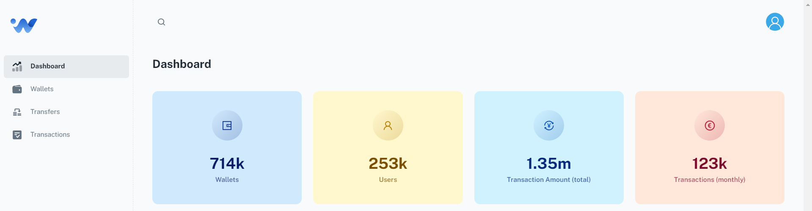
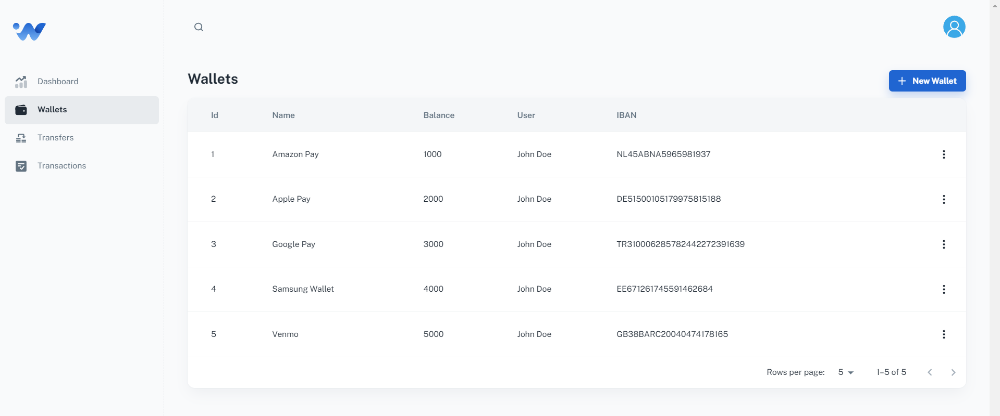
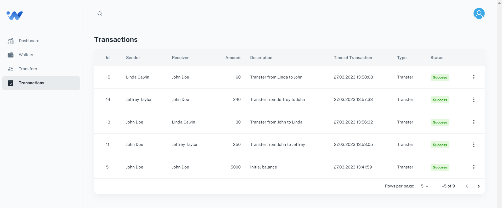
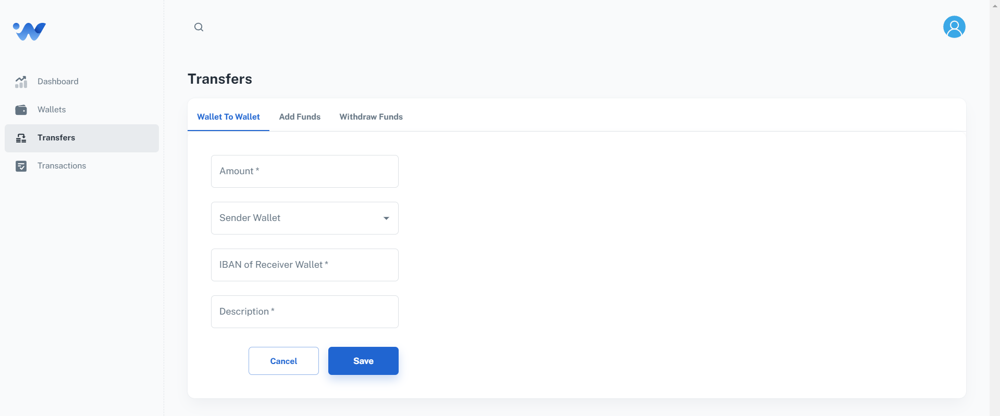

## e-wallet 
Full stack e-wallet app with React, Spring Boot, Spring Security, Spring Data JPA, Hibernate, PostgreSQL, etc.

 

 

 

 

### Description
This application allows users to implement e-wallet with REST API to create it, top it up, check its balance and withdraw. 
Users can register and login to the system using their credentials. They can also add any wallets for any account provided by IBAN 
and transfer to their wallet or any other wallet defined in the system.

 

### Domain Model

The information about the entities is given on [Entity Relationship Diagram](backend/src/main/resources/docs/er_diagram.md) section.

 

### Getting Started

In order to run and test the application, see details on [How to run?](backend/src/main/resources/docs/how_to_run.md) and [How to test?](backend/src/main/resources/docs/how_to_test.md) sections.

 

### Dependencies

* Spring Boot
* Spring Web
* Spring Security
* Spring Data JPA
* Lombok
* MapStruct
* PostgreSQL
* Flyway
* React
* Node.js
* Material UI

 

### Documentation
[Spring Boot](https://docs.spring.io/spring-boot/docs/current/reference/htmlsingle/) 
[Spring Security](https://docs.spring.io/spring-security/reference/index.html) 
[Spring Data JPA](https://docs.spring.io/spring-data/jpa/docs/current/reference/html/) 
[springdoc-openapi v2](https://springdoc.org/v2/) 
[MapStruct](https://mapstruct.org/) 
[JUnit 5](https://junit.org/junit5/docs/snapshot/user-guide/) 
[Entity Relationship Diagram (ERD)](https://www.lucidchart.com/pages/er-diagrams) 
[React](https://react.dev/) 
[Material UI](https://mui.com/) 
[Notistack](https://notistack.com/features/basic) 

 

### Version History

* v1.0.0 Initial Release

 
 